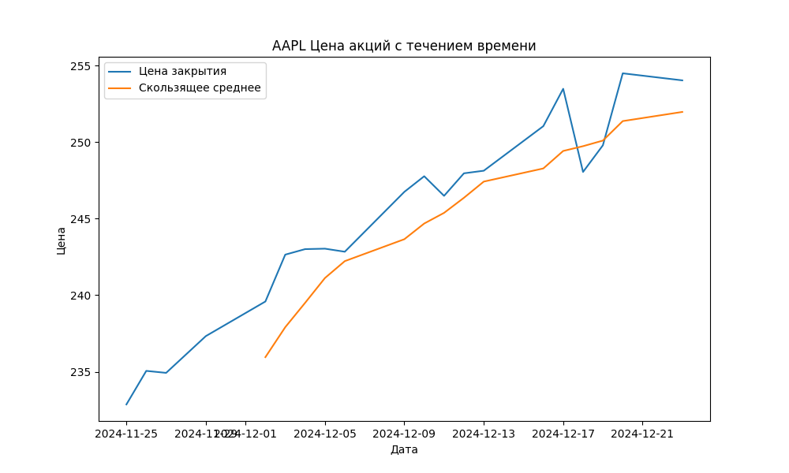
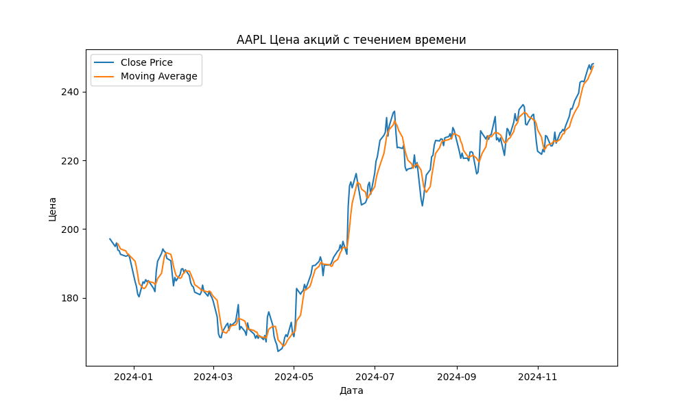
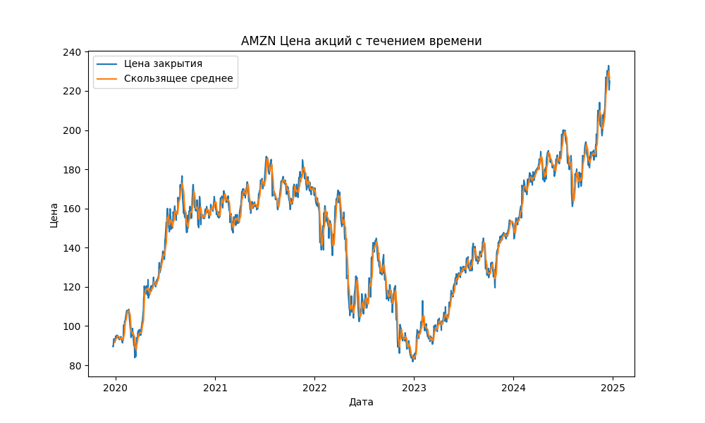
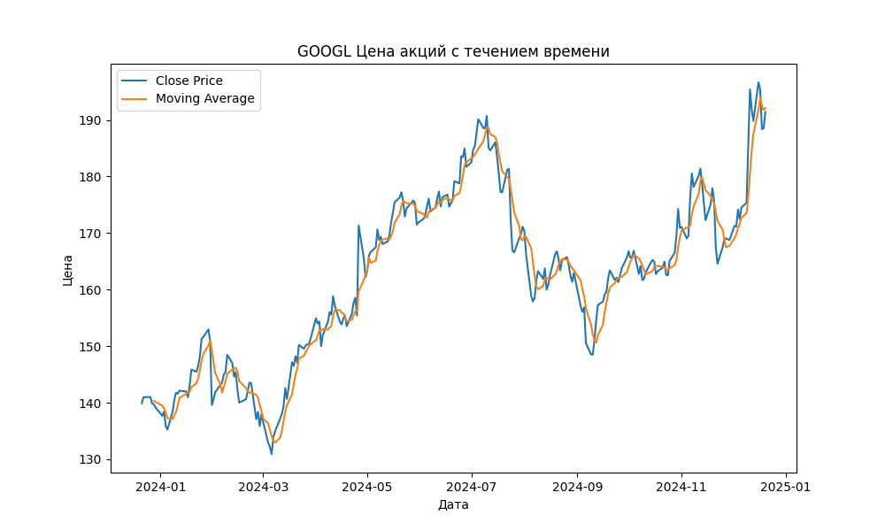
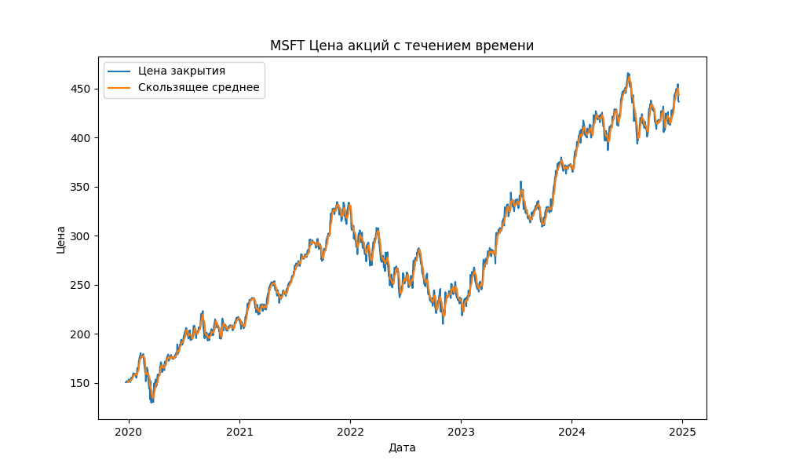
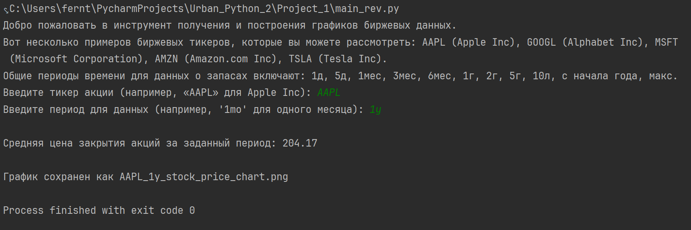
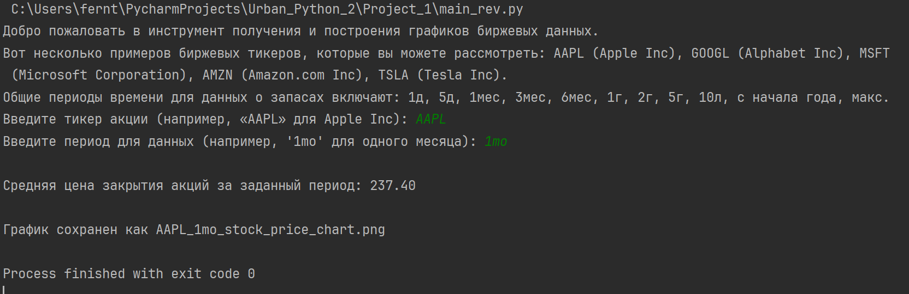

# Проект анализа и визуализации данных об акциях

## Ссылка на проект
[Ссылка на проект](#)

## Общий обзор
Этот проект предназначен для загрузки исторических данных об акциях и их визуализации. Он использует библиотеку `yfinance` для получения данных и `matplotlib` для создания графиков. Пользователи могут выбирать различные тикеры и временные периоды для анализа, а также просматривать движение цен и скользящие средние на графике.

## Структура и модули проекта

### 1. `data_download.py`
- Отвечает за загрузку данных об акциях.
- Содержит функции для извлечения данных об акциях из интернета и расчёта скользящих средних.

### 2. `main.py`
- Является точкой входа в программу.
- Запрашивает у пользователя тикер акции и временной период, загружает данные, обрабатывает их и выводит результаты в виде графика.

### 3. `data_plotting.py`
- Отвечает за визуализацию данных.
- Содержит функции для создания и сохранения графиков цен закрытия и скользящих средних.

## Описание функций

### 1. `data_download.py`
- `fetch_stock_data(ticker, period)`: Получает исторические данные об акциях для указанного тикера и временного периода. Возвращает DataFrame с данными.
- `add_moving_average(data, window_size)`: Добавляет в DataFrame колонку со скользящим средним, рассчитанным на основе цен закрытия.

### 2. `main.py`
- `main()`: Основная функция, управляющая процессом загрузки, обработки данных и их визуализации. Запрашивает у пользователя ввод данных, вызывает функции загрузки и обработки данных, а затем передаёт результаты на визуализацию.

### 3. `data_plotting.py`
- `create_and_save_plot(data, ticker, period, filename)`: Создаёт график, отображающий цены закрытия и скользящие средние. Предоставляет возможность сохранения графика в файл. Параметр `filename` опционален; если он не указан, имя файла генерируется автоматически.

## Пошаговое использование

1. Запустить `main.py`.
2. Ввести интересующий тикер акции (например, 'AAPL' для Apple Inc).
3. Ввести желаемый временной период для анализа (например, '1mo' для данных за один месяц).
4. Программа обработает введённые данные, загрузит соответствующие данные об акциях, рассчитает скользящее среднее и отобразит график.

## Улучшения исходного кода
1. Реализована функция calculate_and_display_average_price(data), которая вычисляет и выводит среднюю цену закрытия акций за заданный период. Функция принимает DataFrame и вычисляет среднее значение колонки 'Close'. Результат выводится в консоль.

# Примеры графиков акций

## График цен акций и скользящего среднего для компании Apple

## График цен акций и скользящего среднего для компании Amazon

## График цен акций и скользящего среднего для компании Google

## График цен акций и скользящего среднего для компании Microsoft

# Примеры выполнения кода в консоли с выводом средней цены акций за опрееделенный период

## Средняя ценая закрытия акций компании Apple за разные периоды времени

