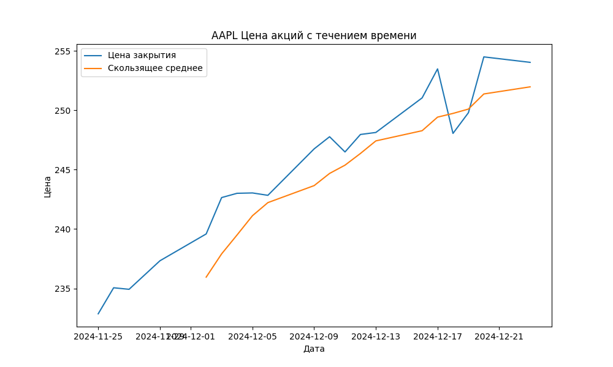
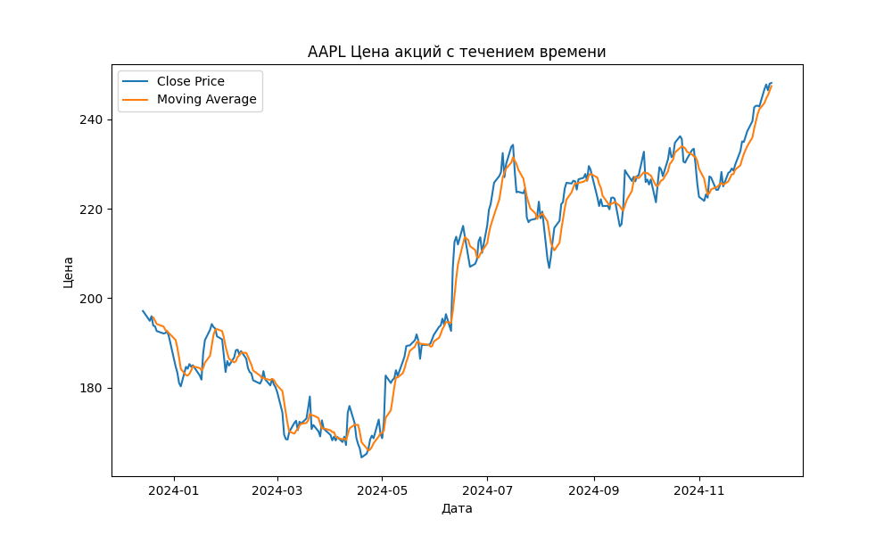
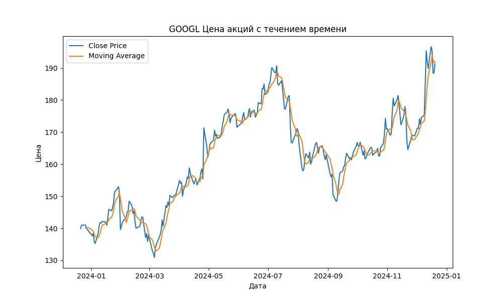
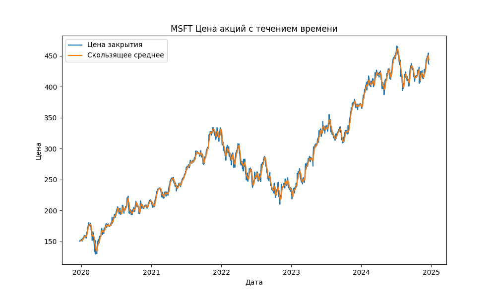
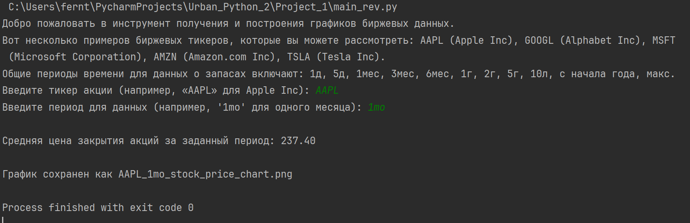
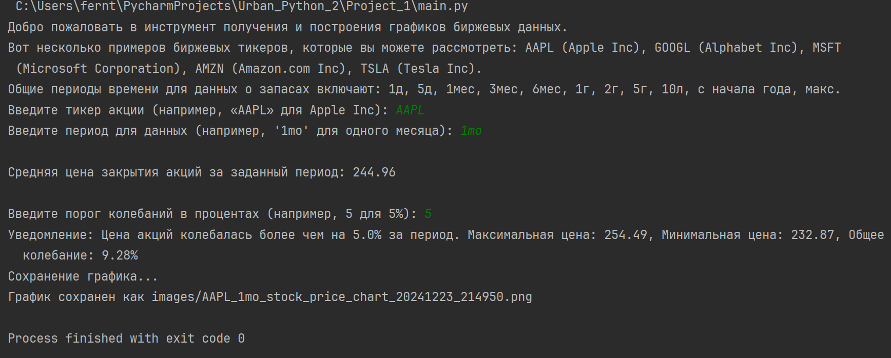
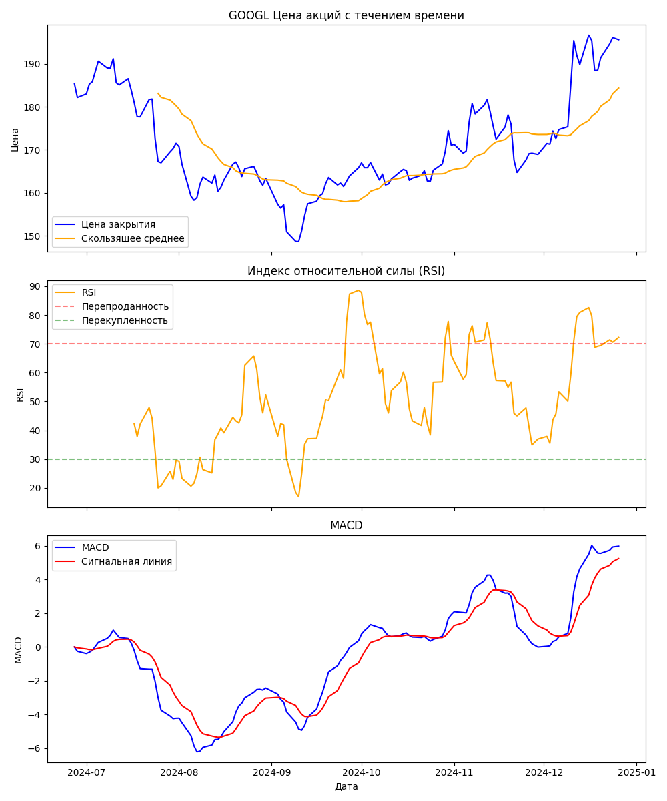
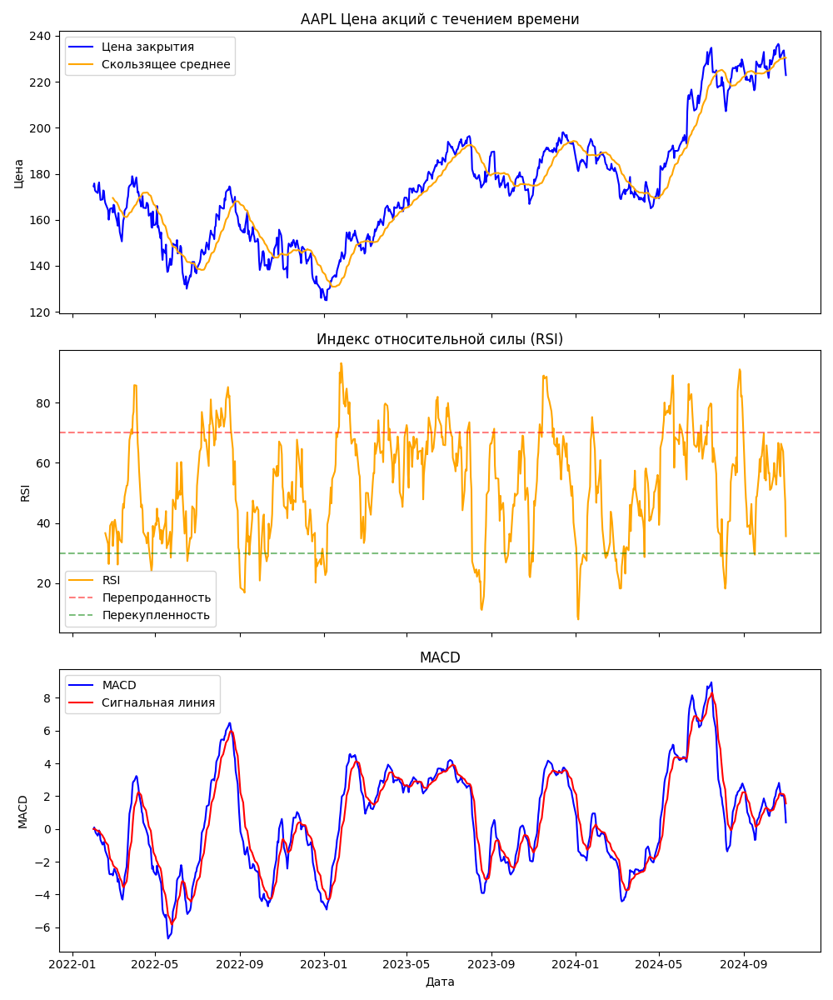

# Проект анализа и визуализации данных об акциях

## Общий обзор
Этот проект предназначен для загрузки исторических данных об акциях и их визуализации. Он использует библиотеку `yfinance` для получения данных и `matplotlib` для создания графиков. Пользователи могут выбирать различные тикеры и временные периоды для анализа, а также просматривать движение цен и скользящие средние на графике.

## Структура и модули проекта

### 1. `data_download.py`
- Отвечает за загрузку данных об акциях.
- Содержит функции для извлечения данных об акциях из интернета и расчёта скользящих средних.

### 2. `main.py`
- Является точкой входа в программу.
- Запрашивает у пользователя тикер акции и временной период, загружает данные, обрабатывает их и выводит результаты в виде графика.

### 3. `data_plotting.py`
- Отвечает за визуализацию данных.
- Содержит функции для создания и сохранения графиков цен закрытия и скользящих средних.

## Описание функций

### 1. `data_download.py`
- `fetch_stock_data(ticker, period)`: Получает исторические данные об акциях для указанного тикера и временного периода. Возвращает DataFrame с данными.
- `add_moving_average(data, window_size)`: Добавляет в DataFrame колонку со скользящим средним, рассчитанным на основе цен закрытия.

### 2. `main.py`
- `main()`: Основная функция, управляющая процессом загрузки, обработки данных и их визуализации. Запрашивает у пользователя ввод данных, вызывает функции загрузки и обработки данных, а затем передаёт результаты на визуализацию.

### 3. `data_plotting.py`
- `create_and_save_plot(data, ticker, period, filename)`: Создаёт график, отображающий цены закрытия и скользящие средние. Предоставляет возможность сохранения графика в файл. Параметр `filename` опционален; если он не указан, имя файла генерируется автоматически.

## Пошаговое использование

1. Запустить `main.py`.
2. Ввести интересующий тикер акции (например, 'AAPL' для Apple Inc).
3. Ввести желаемый временной период для анализа (например, '1mo' для данных за один месяц).
4. Программа обработает введённые данные, загрузит соответствующие данные об акциях, рассчитает скользящее среднее и отобразит график.

## Улучшения исходного кода
1. Реализована функция calculate_and_display_average_price(data), которая вычисляет и выводит среднюю цену закрытия акций за заданный период. Функция принимает DataFrame и вычисляет среднее значение колонки 'Close'. Результат выводится в консоль.
2. Разработана функция notify_if_strong_fluctuations(data, threshold), которая анализирует данные и уведомляет пользователя, если цена акций колебалась более чем на заданный процент за период. Функция вычисляет максимальное и минимальное значения цены закрытия и сравнивать разницу с заданным порогом. Если разница превышает порог, пользователь получает уведомление. В данной версии улучшения кода в имя файла добавлена текущая дата и время для удобства протоколирования результатов расчета.
3. Добавлена функция export_data_to_csv(data, filename), которая позволяет сохранять загруженные данные об акциях в CSV файл. Дополнительно к этому в имя файла добавлена текущая дата и время.
На этой стадии каталог 'images' переименован в 'results' в целях накапливания всех результатов расчте в одном каталоге, и изображений и данных.
В качестве примера на этой стадии добавлены 
графический файл AAPL_5y_stock_price_chart_20241225_073438.png
CSV файл AAPL_5y_stock_data_20241225_073428.csv
4. Реализована функция для расчёта и отображения на графике дополнительных технических индикаторов, например, RSI или MACD.
Соответствующие исзенения внесены в файлы main.py, data_download.py, data_plotting
5. Реализована функция улучшения управления временным периодом.
6. Реализована функция добавления параметра для выбора стиля графика.
Стили заимствована в источнике https://matplotlib.org/stable/gallery/style_sheets/style_sheets_reference.html

# Примеры графиков акций

## График цен акций и скользящего среднего для компании Apple

## График цен акций и скользящего среднего для компании Amazon

## График цен акций и скользящего среднего для компании Google

## График цен акций и скользящего среднего для компании Microsoft

# Примеры выполнения кода в консоли с выводом средней цены акций за опрееделенный период

## Средняя ценая закрытия акций компании Apple за разные периоды времени

## Ввод порога колебаний цены и уведомление о превышении цены акций компании Apple за 1 месяц

## Цена акций, а также индексы RSI и Macd комании Google за период 6 месяцев

## Цена акций, а также индексы RSI и Macd комании Apple за заданный период

## Пример выбора стиля графика "bmh" (Bayesian Methods for Hackers)

## Пример выбора стиля графика "dark_background"

